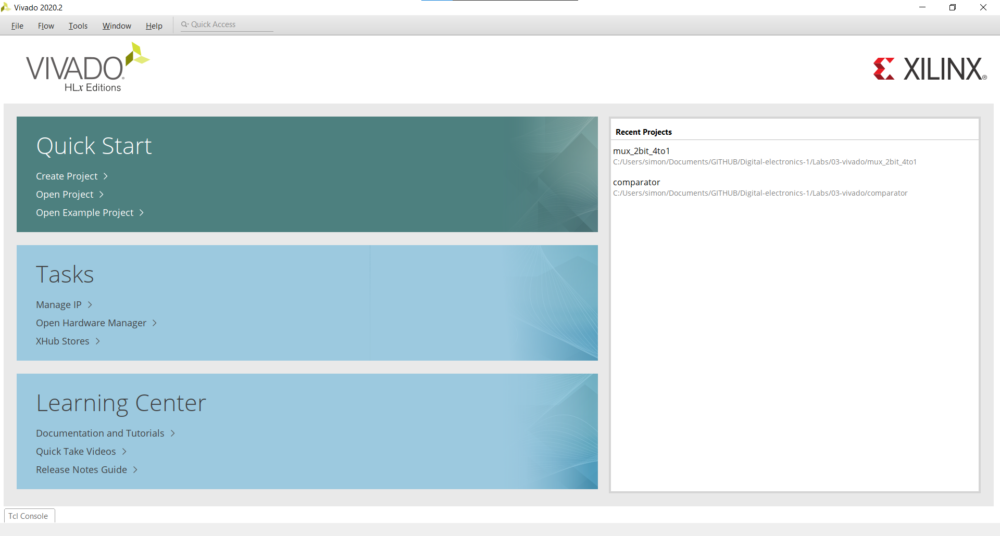
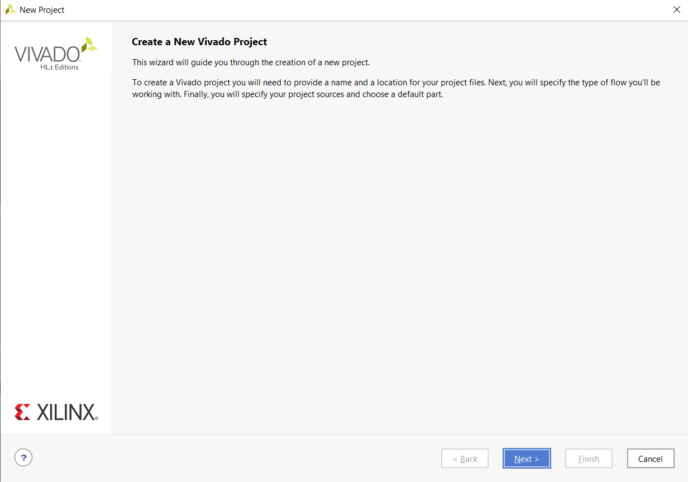
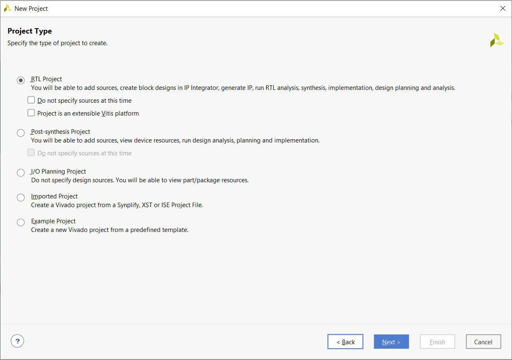
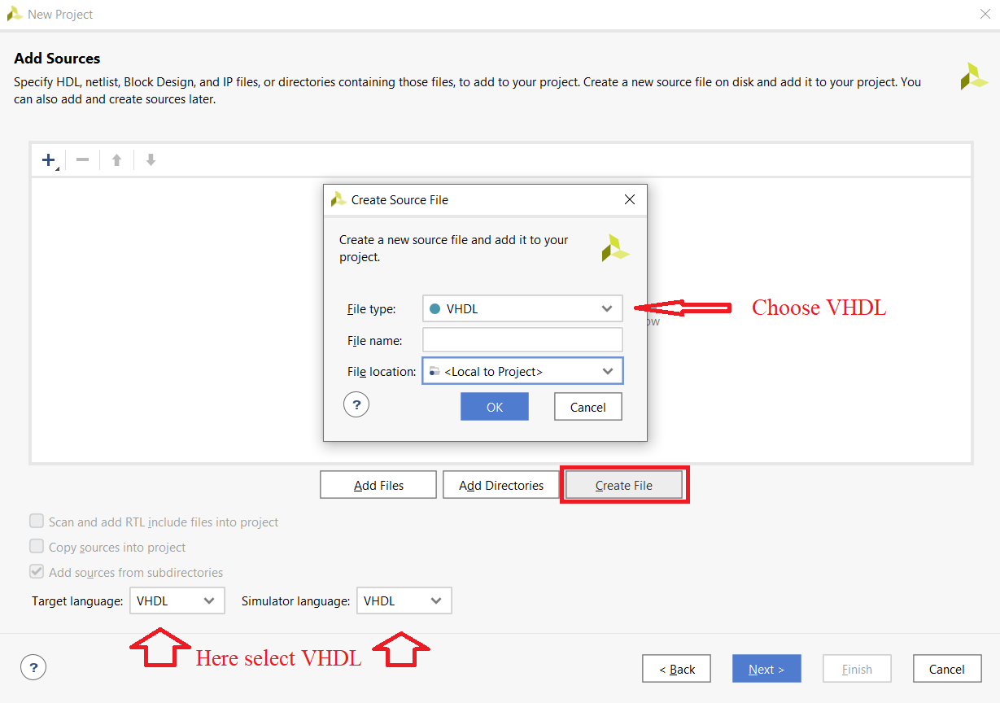
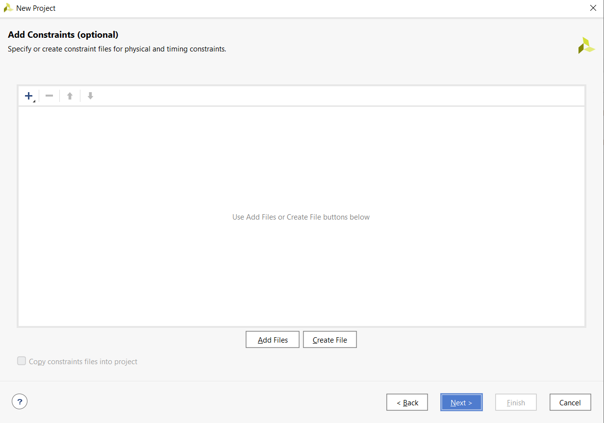
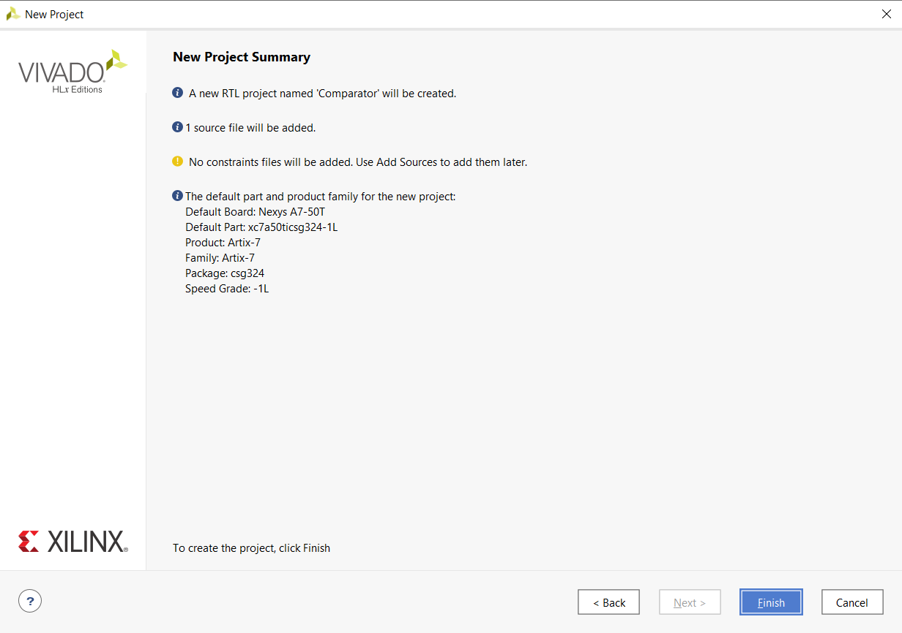
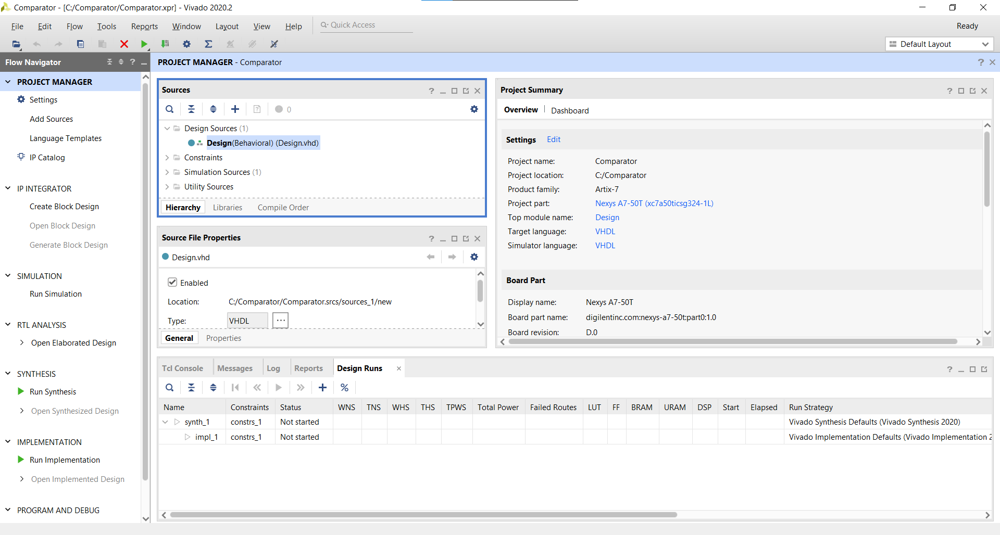
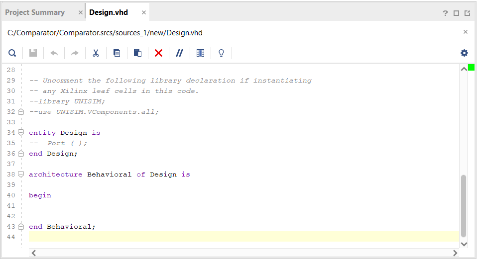
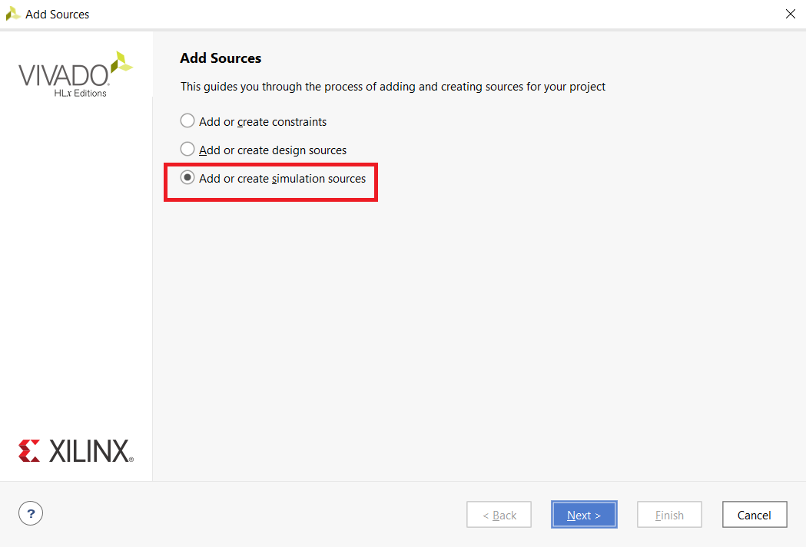
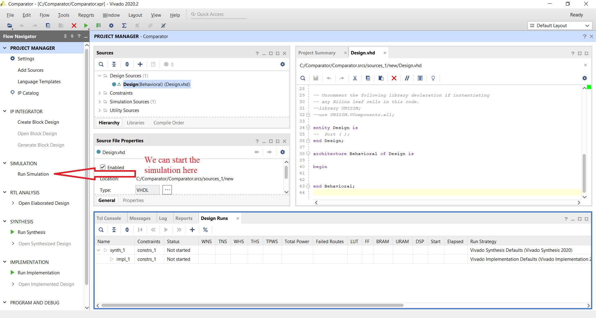

# Labs - 03 - Vivado

## Lab assignment

1. Preparation tasks (done before the lab at home). Submit:
    * Figure or table with connection of 16 slide switches and 16 LEDs on Nexys A7 board.

2. Two-bit wide 4-to-1 multiplexer. Submit:
    * Listing of VHDL architecture from source file `mux_2bit_4to1.vhd` with syntax highlighting,
    * Listing of VHDL stimulus process from testbench file `tb_mux_2bit_4to1.vhd` with syntax highlighting,
    * Screenshot with simulated time waveforms; always display all inputs and outputs.

3. A Vivado tutorial. Submit:
    * Your tutorial for Vivado design flow: project creation, adding source file, adding testbench file, running simulation, (adding XDC constraints file).


## 1. Preparation tasks (done before the lab at home).

### 1.1. Figure or table with connection of 16 slide switches and 16 LEDs on Nexys A7 board.

**Table created from the "Nexys A7™ FPGA Board Reference Manual" and [schematic](https://github.com/tomas-fryza/Digital-electronics-1/blob/master/Docs/nexys-a7-sch.pdf)**


| **SW** | **SW pins** | **SW Connection type** |****| **LEDs** | **LED pins** | **SW Connection Type**  |
| :-: | :-: | :-: | :-: | :-: | :-: | :-: |
| 1  | J15 | IOSTANDARD LVCMOS33 | | 1  | H17 |IOSTANDARD LVCMOS33 |
| 2  | L16 | IOSTANDARD LVCMOS33 | | 2  | K15 |IOSTANDARD LVCMOS33 |
| 3  | M13 | IOSTANDARD LVCMOS33 | | 3  | J13 |IOSTANDARD LVCMOS33 |
| 4  | R15 | IOSTANDARD LVCMOS33 | | 4  | N14 |IOSTANDARD LVCMOS33 |
| 5  | R17 | IOSTANDARD LVCMOS33 | | 5  | R18 |IOSTANDARD LVCMOS33 |
| 6  | T18 | IOSTANDARD LVCMOS33 | | 6  | V17 |IOSTANDARD LVCMOS33 |
| 7  | U18 | IOSTANDARD LVCMOS33 | | 7  | U17 |IOSTANDARD LVCMOS33 |
| 8  | R13 | IOSTANDARD LVCMOS33 | | 8  | U16 |IOSTANDARD LVCMOS33 |
| 9  | T8  | IOSTANDARD LVCMOS18 | | 9  | V16 |IOSTANDARD LVCMOS33 |
| 10 | U8  | IOSTANDARD LVCMOS18 | | 10 | T15 |IOSTANDARD LVCMOS33 |
| 11 | R16 | IOSTANDARD LVCMOS33 | | 11 | U14 |IOSTANDARD LVCMOS33 |
| 12 | T13 | IOSTANDARD LVCMOS33 | | 12 | T16 |IOSTANDARD LVCMOS33 |
| 13 | H6  | IOSTANDARD LVCMOS33 | | 13 | V15 |IOSTANDARD LVCMOS33 |
| 14 | U12 | IOSTANDARD LVCMOS33 | | 14 | V14 |IOSTANDARD LVCMOS33 |
| 15 | U11 | IOSTANDARD LVCMOS33 | | 15 | V12 |IOSTANDARD LVCMOS33 |
| 16 | V10 | IOSTANDARD LVCMOS33 | | 16 | V11 |IOSTANDARD LVCMOS33 |

## 2. Two-bit wide 4-to-1 multiplexer.

### 2.1. Listing of VHDL architecture from source file `mux_2bit_4to1.vhd` with syntax highlighting

> Excerpt from `mux_2bit_4to1.vhd`:
```vhdl
architecture Behavioral of mux_2bit_4to1  is
begin
    f_o <= a_i when (sel_i = "00") else
           b_i when (sel_i = "01") else
           c_i when (sel_i = "10") else
           d_i;

end architecture Behavioral;
```
### 2.2. Listing of VHDL stimulus process from testbench file `tb_mux_2bit_4to1.vhd` with syntax highlighting,

> Excerpt from `tb_mux_2bit_4to1.vhd`:
```vhdl
    p_stimulus : process
    begin
        report "Stimulus process started" severity note;


        s_d <= "00"; s_c <= "00"; s_b <= "00"; s_a <= "00";
        s_sel <= "00"; wait for 100 ns;
        
        s_d <= "00"; s_c <= "00"; s_b <= "10"; s_a <= "00";
        s_sel <= "00"; wait for 100 ns;
        
        s_d <= "00"; s_c <= "10"; s_b <= "01"; s_a <= "11";
        s_sel <= "00"; wait for 100 ns;
        
        s_d <= "10"; s_c <= "11"; s_b <= "01"; s_a <= "00"; 
        s_sel <= "10"; wait for 100 ns;

        
        report "Stimulus process finished" severity note;
        wait;
    end process p_stimulus;
```

### 2.3. Screenshot with simulated time waveforms; always display all inputs and outputs.


## 3. A Vivado tutorial.

### 3.1. Your tutorial for Vivado design flow: project creation, adding source file, adding testbench file, running simulation, (adding XDC constraints file).

If you want to create a project in Vivado, you can try the following tutorial

This window will appear when you start Vivado...


Now you can open an existing project (`Open Project`) or start a new one (`Create Project`)
We will continue to create a new project (`Create Project`)...



Click the button `NEXT`. Now we see a window where we can name the project and set the location...


Now click again the button `NEXT`...



Now we see a window called **Add Sources**.
Click on `Create File` and after that to the **File name** field write **Design**. Now click `OK` after that `Next`...



Now we see a window called **Add Constraints**. Here press `Next`.
Here we use parts of old codes, so we skip...


In the window called **Default Part** 
The next step is important because we choose the board for which we will create a code. We are using board Nexys A7-50T.
So we select the appropriate board and continue to `Next`...


Now we see a summary of our created project.
Click `Finish` and the project will be created...


The project is now created. In sources you can open your `name_of_your_sources".vhd` file and write your code...




For creating a file named "testbench" choose `File/Add Sources`. 
After that choose `Add or create simulation sources` as you can see in the picture (the process is similar to creating the Design.vhd earlier)...


We can start the simulation here...

or you can follow this steps `Flow/Run Simulation/Run Behavioral Simulation`

